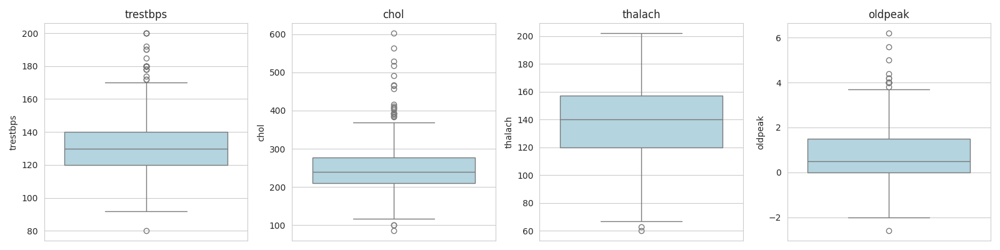
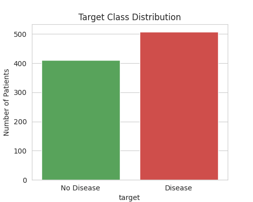
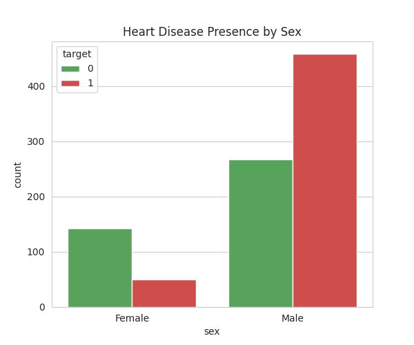
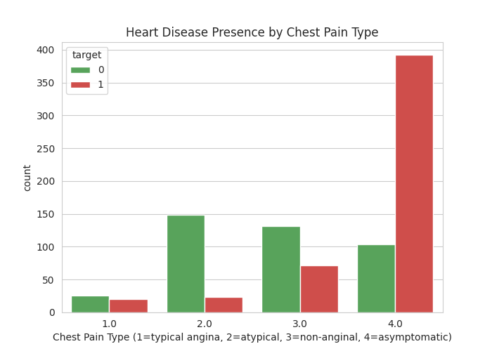
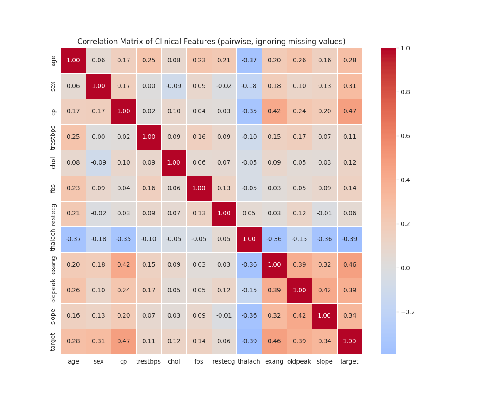
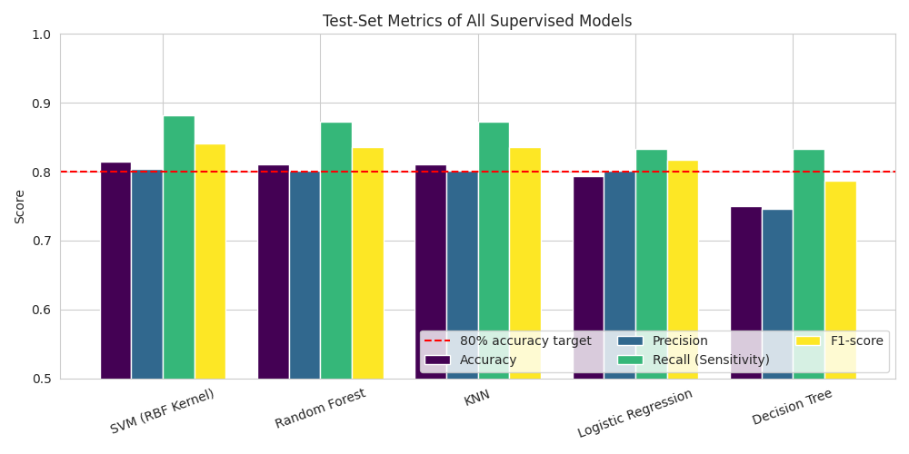
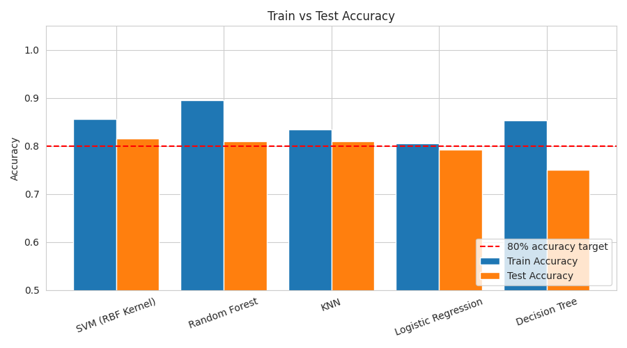
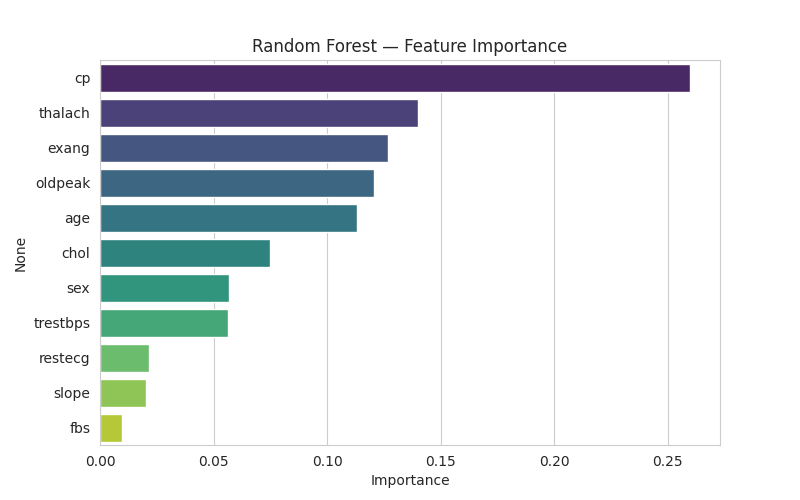
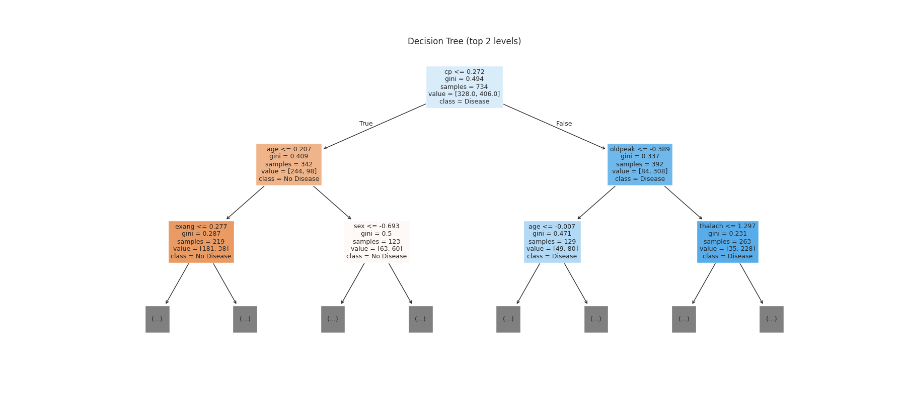
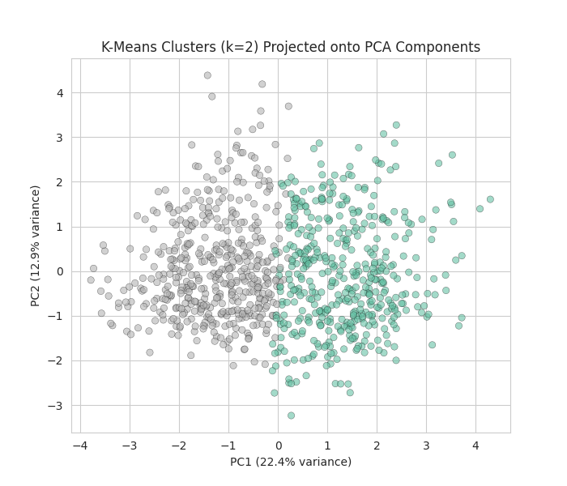

<div align="center">

# ❤️ Heart Disease Prediction Using Machine Learning

**An end-to-end ML project: clinical data → leakage-free preprocessing → 5 supervised models + K-Means → deployable pipeline with a Streamlit app.**


### 🚀 [**Live Demo → Try the App**](https://heartdiseasepredictionml1.streamlit.app/)

</div>

---

## 📌 Overview

Heart disease is conventionally diagnosed through invasive and expensive procedures such as angiography. This project uses **routinely collected clinical measurements** (age, blood pressure, cholesterol, ECG results, etc.) to predict whether a patient has heart disease, enabling faster and cheaper **risk screening**.

The project compares **five supervised classifiers** and **K-Means clustering** on a real, multi-hospital dataset, then exports the best model as a **single reusable scikit-learn pipeline** that powers a **Streamlit web app**.

**Course project:** Machine Learning (3170724), Computer Engineering, C. K. Pithawala College of Engineering and Technology, Surat.

---

## 🏆 Highlights

| | |
|---|---|
| 🥇 **Best model** | SVM (RBF kernel), **81.5% test accuracy**, **88.2% recall** |
| 🏥 **Data** | 920 patient records combined from **4 hospitals** (UCI Heart Disease) |
| 🧼 **Real-world cleaning** | Invalid zeros → missing, heavily-missing columns dropped, duplicates removed, outliers capped |
| 🔒 **No data leakage** | Imputation, outlier limits and scaling are learned from the **training set only** |
| 🤖 **Models compared** | Logistic Regression, KNN, Decision Tree, Random Forest, SVM + K-Means |
| 📦 **Deployed** | Full pipeline saved as `.pkl` and live on Streamlit Community Cloud: [open the app](https://heartdiseasepredictionml1.streamlit.app/) |

---

## 📊 Dataset

**UCI Heart Disease Dataset**, combined from four hospitals: [archive.ics.uci.edu/dataset/45/heart+disease](https://archive.ics.uci.edu/dataset/45/heart+disease)

| Source Hospital | Records |
|---|---|
| Cleveland | 303 |
| Hungarian | 294 |
| VA Long Beach | 200 |
| Switzerland | 123 |
| **Total** | **920** |

A `source` column was added to track the originating hospital. Combining all four makes the data more realistic (heterogeneous, with varying amounts of missing data) than using a single clean hospital.

**Target:** the original `num` (0 = no disease, 1–4 = increasing severity) was converted to a **binary target** (`1` = disease present, `0` = absent). After cleaning, the classes are 508 disease vs 410 no-disease (55.3% positive).

**Features used (11):** `age`, `sex`, `cp`, `trestbps`, `chol`, `fbs`, `restecg`, `thalach`, `exang`, `oldpeak`, `slope`

---

## 🧼 Data Preprocessing

| Step | What was done |
|---|---|
| **Invalid zeros** | 172 cholesterol and 1 resting BP values of `0` are physiologically impossible, so they were converted to missing |
| **Missing value analysis** | Per-column missing counts and percentages computed |
| **Dropped columns** | `ca` (66.4% missing) and `thal` (52.8% missing) were dropped rather than filling more than half a column with invented values |
| **Duplicates** | 2 duplicate rows removed (920 → 918 records) |
| **Outlier detection** | Box plots and the IQR rule (`trestbps` 27, `chol` 23, `thalach` 2, `oldpeak` 16 outliers) |
| **Train/test split** | 80/20 stratified split (734 train / 184 test), `random_state=42` |
| **Imputation** | Median for continuous features, most-frequent for categorical features (fit on train only) |
| **Outlier capping** | IQR-based capping with limits learned from the training set only |
| **Scaling** | `StandardScaler` fit on the training set only |

### Outlier Detection (Box Plots)


---

## 🔍 Exploratory Data Analysis

### Target Class Distribution
The classes are reasonably balanced, so no resampling was needed.



### Heart Disease by Sex


### Heart Disease by Chest Pain Type
Asymptomatic chest pain (type 4) shows by far the highest share of disease cases.



### Correlation Matrix
Features most correlated with the target: `cp` (0.47), `exang` (0.46), `thalach` (-0.39), `oldpeak` (0.39), `slope` (0.34).



---

## 🤖 Models Implemented

### Supervised Learning (5 algorithms)

| Model | Configuration |
|---|---|
| Logistic Regression | `max_iter=1000` |
| K-Nearest Neighbors | `n_neighbors=7` |
| Decision Tree | `max_depth=5` |
| Random Forest | `n_estimators=300`, `max_depth=6` |
| SVM | RBF kernel |

Each model was evaluated with **accuracy, precision, recall, F1-score and a confusion matrix**, using one shared evaluation function so the comparison is fair.

### Unsupervised Learning
**K-Means** (k = 2 to 5) was evaluated with **Silhouette Score** and **Adjusted Rand Index (ARI)** against the true diagnosis, and visualised in 2D using **PCA**.

---

## 📈 Results

### Supervised Model Comparison (Test Set)

| Model | Accuracy | Precision | Recall | F1-score | Train Acc. | Train-Test Gap |
|---|---|---|---|---|---|---|
| **SVM (RBF Kernel)** 🏆 | **0.815** | **0.804** | **0.882** | **0.841** | 0.856 | 0.041 |
| Random Forest | 0.810 | 0.802 | 0.873 | 0.836 | 0.895 | 0.085 |
| KNN | 0.810 | 0.802 | 0.873 | 0.836 | 0.834 | 0.024 |
| Logistic Regression | 0.793 | 0.802 | 0.833 | 0.817 | 0.805 | 0.012 |
| Decision Tree | 0.750 | 0.746 | 0.833 | 0.787 | 0.854 | 0.104 |

SVM achieved the best score on **every** metric. Three models (SVM, Random Forest, KNN) cleared the 80% accuracy target. Logistic Regression generalised most consistently (smallest train-test gap), while the Decision Tree overfit the most.





### Random Forest Feature Importance
Chest pain type (`cp`), max heart rate (`thalach`), exercise-induced angina (`exang`), ST depression (`oldpeak`) and `age` are the strongest predictors.



### Decision Tree (Top 2 Levels)
The tree splits first on chest pain type, then on age and ST depression, giving interpretable if-else rules.



### K-Means Clustering (k = 2) on PCA Components

| k | Silhouette Score | Adjusted Rand Index |
|---|---|---|
| **2** | 0.153 | **0.303** |
| 3 | 0.167 | 0.219 |
| 4 | 0.159 | 0.141 |
| 5 | 0.123 | 0.144 |

K=2 aligns best with the true diagnosis, but the groups are only weakly separated. As expected, unsupervised clustering is useful for exploration and less accurate than supervised classification, since it never sees the labels.



---

## 📦 Production Pipeline

`train_model.py` trains and exports a **single scikit-learn `Pipeline`** so the exact same preprocessing is applied at training and prediction time:

```
Raw input
   │
   ▼
ColumnTransformer
   ├── Continuous (trestbps, chol, thalach, oldpeak): Median Imputer → IQRCapper (custom)
   ├── Categorical (fbs, restecg, exang, slope):      Most-Frequent Imputer
   └── Passthrough (age, sex, cp)
   │
   ▼
StandardScaler
   │
   ▼
SVC (RBF kernel)
```

- **`IQRCapper`** is a custom scikit-learn transformer (`custom_transformers.py`) that learns the IQR limits from training data and clips outliers.
- Outputs: `Model/heart_disease_pipeline.pkl` and `Model/metrics.json` (test metrics, feature ranges and defaults, scikit-learn version).

---

## 🌐 Live Web App

🔗 **[heartdiseasepredictionml1.streamlit.app](https://heartdiseasepredictionml1.streamlit.app/)**

The Streamlit app loads the saved pipeline and lets a user enter the 11 clinical features through a simple form (dropdowns for categorical fields, number inputs with the valid range shown for each field). Clicking **Predict** returns whether heart disease is predicted.

**Try these example inputs**

| Field | High-risk example | Low-risk example |
|---|---|---|
| Age | 62 | 35 |
| Sex | 1 - Male | 0 - Female |
| Chest Pain Type | 4 - Asymptomatic | 2 - Atypical angina |
| Resting Blood Pressure | 145 | 110 |
| Serum Cholesterol | 260 | 180 |
| Fasting Blood Sugar > 120 | 0 - No | 0 - No |
| Resting ECG Result | 0 - Normal | 0 - Normal |
| Max Heart Rate Achieved | 110 | 170 |
| Exercise-Induced Angina | 1 - Yes | 0 - No |
| ST Depression | 2.5 | 0.0 |
| Slope of Peak ST Segment | 2 - Flat | 1 - Upsloping |
| **Prediction** | **Disease** | **No disease** |

> ⚠️ This tool is for educational purposes only and is not a substitute for professional medical diagnosis.

---

## 🗂️ Project Structure

```
heart_disease_prediction_ML/
├── dataset/                    # Combined UCI heart disease CSV
├── Model/                      # Saved pipeline (.pkl) and metrics.json
├── Notebook/                   # Jupyter notebook with full analysis
├── Screenshots/                # Charts and figures used in this README
├── app.py                      # Streamlit web app
├── custom_transformers.py      # Custom IQRCapper transformer
├── train_model.py              # Trains and exports the full pipeline
└── requirements.txt            # Dependencies
```

---

## 🚀 Getting Started

**1. Clone the repository**
```bash
git clone https://github.com/HarshalVora86/heart_disease_prediction_ML.git
cd heart_disease_prediction_ML
```

**2. Install dependencies**
```bash
pip install -r requirements.txt
```

**3. Train the model and export the pipeline**
```bash
python train_model.py
```

**4. Launch the web app**
```bash
streamlit run app.py
```

---

## 🛠️ Tech Stack

| Area | Tools |
|---|---|
| Language | Python |
| Data handling | Pandas, NumPy |
| Visualisation | Matplotlib, Seaborn |
| Machine learning | scikit-learn (Pipeline, ColumnTransformer, SVC, Random Forest, KNN, Logistic Regression, Decision Tree, K-Means, PCA) |
| Model persistence | Joblib |
| Web app | Streamlit |

---

## 💡 Real-World Applications

- **Clinical decision support:** flag high-risk patients for further cardiac testing using only routine, low-cost measurements.
- **Preventive screening:** integrate into hospital intake systems or health apps for early risk alerts.
- **Resource prioritisation:** help triage patients where specialist cardiology resources are limited.

In screening, **recall** (not missing a sick patient) matters most, so the decision threshold would be lowered in practice.

---

## ⚠️ Limitations

- The dataset is small (920 records) and dates from the late 1980s. With only 184 test patients, accuracy has a margin of error of several percentage points.
- `ca` and `thal` are strong predictors but were dropped because they were mostly missing. Cholesterol (about 22% missing) was imputed, which can introduce bias.
- The four hospitals have different populations and measurement practices, so performance may not transfer to a new hospital.
- The model predicts disease **presence**, not severity or prognosis. It **supports but does not replace** a clinician.

---

## 👥 Team

| Name |
|---|
| Smit Panseriya |
| Harshal Vora |
| Raj Padshala |
| Pruthil Vaghasiya |

**Faculty:** Mithila Parekh

---

<div align="center">

⭐ If you found this project useful, consider giving it a star!

</div>
